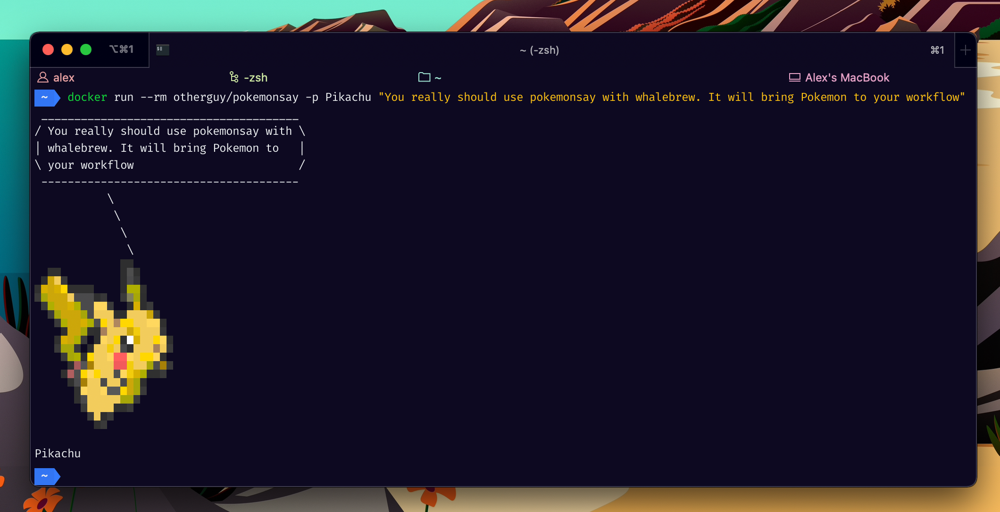

# Pokemonsay for 🐳 Docker

_This repository provides the [`otherguy/pokemonsay`][dockerhub] image_

[][dockerhub]
[][dockerhub]
[][issues]
[][travis]
[][microbadger]
[][stargazers]
[][license]

[dockerhub]: https://hub.docker.com/r/otherguy/pokemonsay/
[license]: https://tldrlegal.com/license/mit-license
[travis]: https://travis-ci.com/otherguy/docker-pokemonsay
[microbadger]: https://microbadger.com/images/otherguy/pokemonsay
[stargazers]: https://github.com/otherguy/docker-pokemonsay/stargazers
[issues]: https://github.com/otherguy/docker-pokemonsay/issues

## 🌈 What is this?

[`pokemonsay`](https://github.com/possatti/pokemonsay) is like [`cowsay`][https://en.wikipedia.org/wiki/Cowsay] but for Pokémon only, written by [Lucas Possatti](https://github.com/possatti/).

This Docker image intends to bring the awesomeness of [`pokemonsay`](https://github.com/possatti/pokemonsay) to Docker and especially [whalebrew](https://github.com/whalebrew/whalebrew).

## 🚧 Contributing

Bug reports and pull requests are welcome on GitHub at [`otherguy/docker-pokemonsay`](https://github.com/otherguy/docker-pokemonsay).

## ♥️ Acknowledgements

- [Lucas Possatti](https://github.com/possatti/) for creating
## 📝 Legal

All Pokémon rights are property of [The Pokémon Company](https://en.wikipedia.org/wiki/The_Pok%C3%A9mon_Company). This is a  fan project with no ties to The Pokémon Company.
